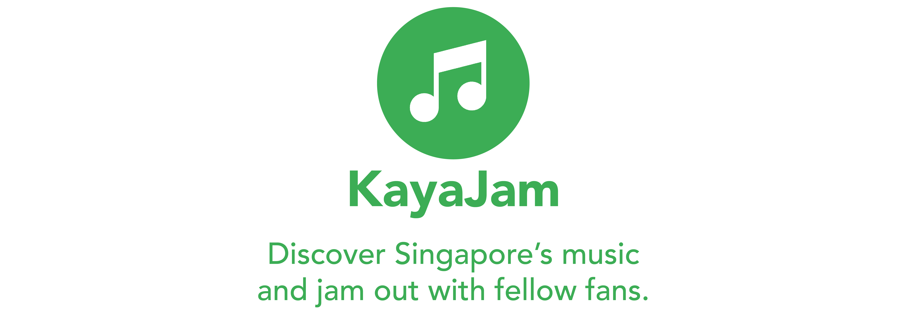

Skip to the section on [starting the app](#3-start-up) if you have already successfully ran the app before.


🚧 Else, if running the app for the first time:

## 1. Pre-requisites

Ensure you have the following.

- `JAVA_HOME` environment variable set to your Java SDK location. <small>(See FAQ if you did not already configure this)</small>
- `.env.local` in the root directory. <small>(If not, add the **client keys and secrets** for <i>Spotify</i> and <i>PubNub</i> for the functioning of the data and chat features)</small>
- **Node.js** installed. <small>(If not, download at https://nodejs.org/en/download/. This is for `npm`)</small>

## 2. First-time set up

- Run `npm i -g json-server`.
- Run `npm i` in the CLI at the root directory.
- **Unzip** `keycloak-15.0.2.zip` in the `server` folder.


## 3. Start up

Go to the `.scripts` folder and run all of the files. <small>(Made for Windows. Edit the contents according to your OS if needed)</small>

⚠️ Do not close these windows - leave them all running at the same time.

> You should now be able to access the app at `localhost` at the following ports by default.
>	- <u>Client:</u> `8081`
>	- <u>Keycloak:</u> `8080`
>	- <u>Database:</u> `3000`

If otherwise specified by any of your CLI windows, do the following.
> - <u>Client:</u> Ensure the `publicPath` in `vue.config.js` is the same.
> - <u>Other:</u> Edit the `.env` file to reflect those ports for `VUE_APP_JSONSERVER_URL` or `VUE_APP_KEYCLOAK_URL`.

If first-time user, register for an account. <small>(If no verification email, check your spam inbox or quarantine page)</small>


## FAQ

### Java setup
1. Download the **JDK** (https://www.oracle.com/java/technologies/downloads/).
2. Run the **installation**. Take note of the <i>JDK download path</i>.
3. Go to your System Properties > Advanced > **Environment Variables**.
	- Under System environment variables, click **New** and fill in the following for the respective fields:
		- <u>Name:</u>		`JAVA_HOME`
		- <u>Value:</u>	<i>< JDK download path ></i>
	- Find your `Path` environment variable and click **Edit**. Add this to the end of the string or otherwise:
		- <i>< JDK download path ></i>`\bin`

### Security error for running `json-server`

"...cannot be loaded because running scripts is disabled on this system"
```
Set-ExecutionPolicy -Scope CurrentUser -ExecutionPolicy RemoteSigned
```
